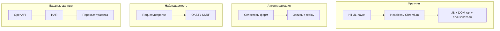

<!--
  Стили: ./styles/index.css (cyberpunk). Исходник тезисов: «Митап - DAST.md»
-->

  
митап · appsec · runtime

  
DAST

  

    Динамический анализ приложений: реальная атакуемость, а не только код
  

  

    runtime
    чёрный ящик
    HTTP / API
    CI/CD
    эволюция
  

---

# Вход / контекст

  
позиция

  
атакуют не код — атакуют работающее приложение

  

    

      
стыки

      
Уязвимости на границах backend ↔ frontend, сервис ↔ сервис, приложение ↔ инфраструктура.

    

    

      
runtime

      
Реальное поведение: headers, cookies, auth-флоу, маршрутизация, сторонние сервисы. Эксплуатируемость видна только в ответах на запросы.

    

    

      
вывод

      
Без проверки работающего приложения мы видим лишь «потенциальные» проблемы, а не реальные атаки.

    

  

  
DAST в продукте — попытка воспроизвести действия атакующего извне (как PT BlackBox).

---

# Индустрия

  

    
архитектура

    
μservices

  

  

    
релизы

    
неск./день

  

  

    
поверхность

    
web + API

  

  
инсайт

  
без runtime-проверки безопасность перестаёт быть достоверной

  <ul>
    <li>Микросервисы и API-first</li>
    <li>Частые деплои</li>
    <li>Рост доли AI-сгенерированного кода</li>
    <li>Рост внешней поверхности атаки</li>
  </ul>

---
layout: two-cols
---

## SAST

- Видит код, не видит поведение
- Не учитывает конфигурацию, инфраструктуру, интеграции
- «Может быть проблема»

::right::

## DAST

- Тестирует работающую систему
- Показывает реальную атакуемость
- «Вот как это ломается»

---

# Что такое DAST

  
определение

  
проверка поведения, а не только кода

  <ul>
    <li>Тестирование работающего приложения (runtime)</li>
    <li>Подход «чёрного ящика»</li>
    <li>Работа через HTTP / API / UI</li>
    <li>Моделирование атак через запросы и анализ ответов</li>
    <li>Комбинация сигнатурного и эвристического анализа</li>
  </ul>

---

# Зачем DAST

  
бизнес

  

    реальная атакуемость
    →
    приоритизация
    →
    периметр
    →
    релиз
  

  <ul>
    <li>Приоритизация: эксплуатируемые vs теоретические</li>
    <li>Меньше шума относительно чистого SAST в части «доказуемости»</li>
    <li>Контроль внешнего периметра, проверка перед релизом</li>
    <li>Разовые сканы и встраивание в CI/CD; gate по интегральной оценке</li>
  </ul>

---

# Виды динамического анализа

  

    
ручной

    
Burp-подход

    
Не pentest как услуга — инструмент для гибкого взаимодействия. Полный контроль HTTP, быстрый feedback.

    
Эталон качества, но не масштабируется; дорог по времени и требует экспертизы.

  

  

    
авто + CI

    
масштаб

    
Регулярные проверки, очередь задач, параллельное сканирование, встраивание в pipeline.

    
Ограниченное понимание контекста; прерывание сборки по порогу защищённости.

  

---

# Проблемы классического DAST

  
боль

  
находит проблемы, но не помогает их решать

  

    

      
шум

      
False positives, непонятно как чинить

    

    

      
процесс

      
Долго, сложная настройка, ломает pipeline (blocking)

    

    

      
контекст

      
Нет бизнес-логики и авторизации → не видна реальная поверхность

    

  

---

# Идеальный DAST

  
не сканер, а платформа

  

    Гибкость ручного анализа (как Burp) + масштаб автоматизации (DevSecOps): прозрачность, расширяемость, enterprise.
  

  

    
режимы

    
auto + interactive

  

  

    
контекст

    
без разрыва

  

---

# Платформа: универсальность и покрытие

  
coverage-by-design

  

    

      <h3>Приложения</h3>
      <ul>
        <li>Классический web, SPA (React, Angular, Vue)</li>
        <li>HTTP / HTTPS, WebSocket</li>
        <li>REST, gRPC, SOAP, GraphQL</li>
      </ul>
    

    

      <h3>Смысл</h3>
      
Не важно, как построено приложение — DAST должен его «понимать». Один инструмент: CI/CD и интерактив без потери контекста.

    

  

---

# Прозрачность и наблюдаемость

  
не чёрный ящик

  <ul>
    <li>Понятно, что делает сканер, какие запросы уходят и почему сработало правило</li>
    <li>OAST: blind XSS, SSRF, DNS/HTTP callbacks — то, что не видно в паре request/response</li>
    <li>Широкий охват CWE, не только «топ-10»</li>
    <li>Дашборды, карта приложения, наглядные отчёты</li>
  </ul>
  
Результат: детали, объяснение «почему», воспроизводимый запрос для разработчика.

---

# Деплой и enterprise

  
от ноутбука до кластера

  

    CLI
    →
    K8s
    →
    масштаб сканеров
  

  <ul>
    <li>Открытый API, webhooks, кастомизация под процесс</li>
    <li>Логирование, аудит, RBAC, backup/restore, hardening</li>
  </ul>
  
OSSПарадокс идеала: бесплатный OSS при активной поддержке. Граница: сложный auth (SSO, OAuth, MFA) — сценарии, replay, стратегии обхода/сервисных аккаунтов.

---

# Ключевой вывод (идеал)

  
платформа

  
исследует как Burp · масштабируется как DevSecOps

  <ul>
    <li>Прозрачная и управляемая</li>
    <li>DAST работает там, где сценарий воспроизводим; MFA ломает воспроизводимость</li>
  </ul>

---

# Практика: отчёт не помогает

  
симптом

  
разработчик не понимает, что делать

  <ul>
    <li>DAST не находит то, чего не понимает в приложении</li>
    <li>Пользователь часто сам не знает систему</li>
  </ul>
  
Инструмент должен помочь понять и исследовать приложение — и только потом искать уязвимости.

---

# Кейс: SPA и «невидимое API»

  
пилот

  

    

      
симптом

      
«Сканер почти ничего не находит»

    

    

      
реальность

      
SPA, логика за API; сканер ходит по фронту и почти не видит backend. Нет OpenAPI — «где взять схему?»

    

    

      
инсайт

      
Проблема не в «плохом поиске», а в том, что неизвестно, где искать — и пользователь может этого не осознавать.

    

  

---

# Решение: HAR

  
показать систему

  

    Chrome
    →
    HAR
    →
    DAST
    →
    endpoint'ы
  

  <ul>
    <li>Реальные endpoint'ы и пользовательские сценарии</li>
    <li>Виден backend, а не только фронт → рост покрытия и реальных находок</li>
  </ul>
  
Если не знаешь, как пользоваться приложением — DAST тоже не знает.

---

# Эволюция DAST

Качество DAST = качество входных данных. Agentic AI для обхода — перспективно, но пока нестабильно для production.

---

# Инженерные опоры

  
из практики

  

    

      
OAST

      
Например <code>kernel.transport.oast</code>, интеграции с interactsh / BOAST; модуль SSRF (без OAST проверки пропускаются, не ошибка).

    

    

      
вывод

      
DAST эволюционирует от набора техник к системе понимания приложения и поведения.

    

  

---

# Расширенные сценарии

  
продукт

  <ul>
    <li>Сканирование микросервисов через OpenAPI</li>
    <li>Анализ периметра, история сканирований</li>
    <li>Отчёты: HTML, JSON, ссылки</li>
  </ul>

---

# Будущее DAST

  
контекст

  
поверхность растёт быстрее процессов безопасности

  <ul>
    <li>Vibe coding, AI — приложения быстрее, чем выстраивание AppSec</li>
    <li>Нужен низкий порог входа: «взял и просканировал»; облако — без своей инфраструктуры</li>
    <li>Векторы: AI в анализе и explain, слияние DAST+SAST+SCA, business-aware security, от findings к fixing</li>
  </ul>

---

# От находки к исправлению

  
LLM How to fix

  <ul>
    <li>Разработчик не понимает fix даже при найденной уязвимости</li>
    <li>LLM: тип уязвимости, endpoint, стек → простое объяснение, шаги, примеры кода/конфига</li>
  </ul>
  
DAST как помощник разработчика, а не только поисковик.

---

# Агентные технологии

  
направления

  

    

      <h3>Атака и логика</h3>
      <ul>
        <li>Адаптивные атаки по ответам приложения</li>
        <li>BOLA и бизнес-логика, роли и сценарии</li>
        <li>Think → Plan → Act; PoC, sandbox</li>
      </ul>
    

    

      <h3>Автономия</h3>
      <ul>
        <li>Авто-ремедиация, PR от агентов</li>
        <li>NHI / AI pipeline security, агентный триаж алертов</li>
      </ul>
      
Strix, Escape, Terra, CHECKMATE, Furl, … — как вектор индустрии.

    

  

  
Будущее: система, которая атакует, доказывает и предлагает исправления — не «просто сканер».

---
layout: center
---

  
вывод

  
РЕАЛЬНАЯ АТАКУЕМОСТЬ

  

    DAST дополняет картину безопасности · эффективность = инструмент + использование · дальше: помогать чинить и действовать автономно
  

  

    runtime truth
    понимание системы
    платформа
  

