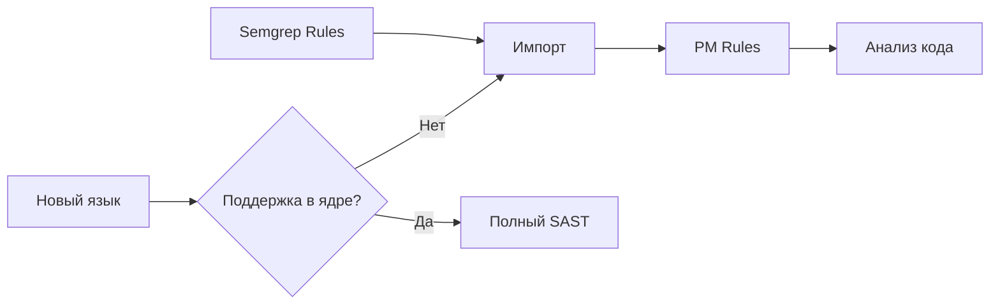
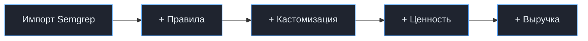
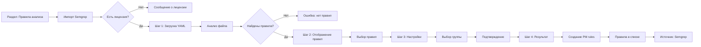

<style>
/* Импорт технологичных шрифтов */
@import url('https://fonts.googleapis.com/css2?family=JetBrains+Mono:wght@300;400;600;700;800&display=swap');

/* Базовые стили с уменьшенным шрифтом на 10% */
.slidev-layout {
  background: linear-gradient(135deg, #0d1117 0%, #1a1f2b 100%);
  color: #e6edf3;
  font-family: 'JetBrains Mono', monospace;
  position: relative;
  font-size: 0.9em;
  padding-top: 0.9rem !important;
  padding-bottom: 0.9rem !important;
}

/* Технологичный фон с сеткой */
.slidev-layout::before {
  content: "";
  position: absolute;
  top: 0;
  left: 0;
  right: 0;
  bottom: 0;
  background-image: 
    linear-gradient(rgba(86, 148, 255, 0.05) 1px, transparent 1px),
    linear-gradient(90deg, rgba(86, 148, 255, 0.05) 1px, transparent 1px);
  background-size: 30px 30px;
  pointer-events: none;
  z-index: 0;
}

.slidev-layout::after {
  content: "◈ ◈ ◈";
  position: absolute;
  bottom: 20px;
  right: 30px;
  color: rgba(86, 148, 255, 0.1);
  font-size: 14px;
  letter-spacing: 8px;
  z-index: 0;
}

.slidev-layout > * {
  position: relative;
  z-index: 1;
}

/* Заголовки в стиле кода (уменьшены на 10%) */
h1 {
  font-family: 'JetBrains Mono', monospace;
  font-weight: 800;
  font-size: 2.5em;
  color: #58a6ff;
  border-bottom: 2px solid #58a6ff;
  padding-bottom: 0.3em;
  margin-bottom: 0.9em;
  letter-spacing: -0.5px;
  text-transform: uppercase;
  position: relative;
  display: inline-block;
}

h1::before {
  content: ">";
  color: #ff7b72;
  margin-right: 10px;
  font-weight: 400;
}

h2 {
  font-family: 'JetBrains Mono', monospace;
  font-weight: 600;
  color: #ff7b72;
  margin-bottom: 0.7em;
  font-size: 1.6em;
  border-left: 4px solid #ff7b72;
  padding-left: 15px;
}

h3 {
  font-family: 'JetBrains Mono', monospace;
  font-weight: 600;
  color: #d2a8ff;
  margin-bottom: 0.4em;
  font-size: 1.26em;
}

/* Стили для кода */
code {
  background: #1f242f;
  color: #ffa657;
  padding: 2px 6px;
  border-radius: 4px;
  font-family: 'JetBrains Mono', monospace;
  border: 1px solid #363b4a;
  font-size: 0.9em;
}

pre {
  background: #1f242f !important;
  border: 1px solid #58a6ff;
  border-radius: 8px;
  font-size: 0.9em;
}

/* ===== ИСПРАВЛЕННЫЕ СТИЛИ ДЛЯ СПИСКОВ ===== */

/* Полностью отключаем стандартные маркеры */
ul, ol, li {
  list-style: none !important;
  list-style-type: none !important;
  margin: 0;
  padding: 0;
}

/* Базовые стили для всех списков */
.slidev-layout ul {
  margin: 0.4em 0;
}

.slidev-layout li {
  margin: 0.5em 0;
  position: relative;
  padding-left: 24px !important;
  line-height: 1.5;
}

/* Добавляем стилизованные маркеры для всех списков */
.slidev-layout li::before {
  content: "→" !important;
  color: #58a6ff;
  font-size: 1em;
  font-weight: bold;
  position: absolute;
  left: 0;
  top: 0;
  display: inline-block;
  width: 18px;
  text-align: left;
}

/* Убираем маркеры у заголовков внутри списков */
.slidev-layout li h1::before,
.slidev-layout li h2::before,
.slidev-layout li h3::before {
  content: none !important;
}

/* Специально для списков в feature-item */
.feature-item ul,
.feature-item ol {
  margin-top: 8px;
}

.feature-item li {
  padding-left: 24px !important;
}

/* Анимация появления */
@keyframes slideIn {
  from {
    opacity: 0;
    transform: translateX(-30px);
  }
  to {
    opacity: 1;
    transform: translateX(0);
  }
}

.slidev-layout li {
  animation: slideIn 0.3s ease-out forwards;
  opacity: 0;
}

.slidev-layout li:nth-child(1) { animation-delay: 0.1s; }
.slidev-layout li:nth-child(2) { animation-delay: 0.2s; }
.slidev-layout li:nth-child(3) { animation-delay: 0.3s; }
.slidev-layout li:nth-child(4) { animation-delay: 0.4s; }
.slidev-layout li:nth-child(5) { animation-delay: 0.5s; }
.slidev-layout li:nth-child(6) { animation-delay: 0.6s; }

/* Карточки (уменьшены) */
.card {
  background: rgba(31, 36, 47, 0.7);
  border: 1px solid #363b4a;
  border-radius: 8px;
  padding: 16px;
  backdrop-filter: blur(5px);
  transition: all 0.3s ease;
}

.card:hover {
  border-color: #58a6ff;
  box-shadow: 0 0 20px rgba(88, 166, 255, 0.2);
  transform: translateY(-2px);
}

/* Стили для таблиц (уменьшены) */
table {
  width: 100%;
  border-collapse: separate;
  border-spacing: 0 6px;
  font-size: 0.9em;
}

th {
  background: #1f242f;
  color: #58a6ff;
  font-weight: 600;
  padding: 8px;
  text-align: left;
  border-bottom: 2px solid #58a6ff;
}

td {
  background: rgba(31, 36, 47, 0.5);
  padding: 8px;
  border-bottom: 1px solid #363b4a;
}

tr:hover td {
  background: rgba(88, 166, 255, 0.1);
}

/* Технологичные кнопки */
.button {
  display: inline-block;
  background: linear-gradient(135deg, #1f242f 0%, #2d3548 100%);
  border: 1px solid #58a6ff;
  color: #58a6ff;
  padding: 6px 14px;
  border-radius: 4px;
  font-weight: 600;
  transition: all 0.3s ease;
  cursor: default;
  font-size: 0.9em;
}

.button:hover {
  background: #58a6ff;
  color: #0d1117;
  box-shadow: 0 0 15px #58a6ff;
}

/* Бейджи */
.badge {
  display: inline-block;
  padding: 3px 7px;
  border-radius: 4px;
  font-size: 0.75em;
  font-weight: 600;
}

.badge.primary { background: #58a6ff; color: #0d1117; }
.badge.secondary { background: #ff7b72; color: #0d1117; }
.badge.success { background: #7ee3b8; color: #0d1117; }
.badge.warning { background: #f0883e; color: #0d1117; }

/* Сетка для фич (уменьшена) */
.feature-grid {
  display: grid;
  grid-template-columns: repeat(auto-fit, minmax(260px, 1fr));
  gap: 16px;
  margin: 16px 0;
}

.feature-item {
  background: rgba(31, 36, 47, 0.7);
  border: 1px solid #363b4a;
  border-radius: 8px;
  padding: 16px;
  transition: all 0.3s ease;
}

.feature-item:hover {
  border-color: #58a6ff;
  transform: scale(1.02);
}

.feature-item h4 {
  color: #58a6ff;
  margin-bottom: 8px;
}

/* Mermaid (уменьшена) */
.mermaid {
  background: rgba(31, 36, 47, 0.7);
  padding: 16px;
  border-radius: 8px;
  border: 1px solid #363b4a;
  animation: fadeIn 0.8s ease-out;
  font-size: 0.9em;
}

@keyframes fadeIn {
  from { opacity: 0; }
  to { opacity: 1; }
}

/* Путь файла */
.filepath {
  background: #1f242f;
  border: 1px solid #363b4a;
  border-radius: 4px;
  padding: 6px 10px;
  font-family: 'JetBrains Mono', monospace;
  color: #7ee3b8;
  display: inline-block;
  font-size: 0.85em;
}

/* Сетка для сравнения (уменьшена) */
.comparison-grid {
  display: grid;
  grid-template-columns: 1fr 1fr;
  gap: 20px;
  margin: 16px 0;
}

/* Стили для стрелок вниз/вверх */
.arrow-up {
  color: #7ee3b8;
  font-weight: bold;
  font-size: 1.1em;
}

.arrow-down {
  color: #ff7b72;
  font-weight: bold;
  font-size: 1.1em;
}

/* Контейнер для центрирования */
.center {
  text-align: center;
}

/* Экстра-компактный режим для особо загруженных слайдов */
.x-compact {
  font-size: 0.85em;
}

.x-compact .feature-item {
  padding: 12px;
}

.x-compact li {
  margin: 0.3em 0;
}

.x-compact h3 {
  font-size: 1.15em;
  margin-bottom: 0.3em;
}

.x-compact .feature-grid {
  gap: 12px;
  margin: 10px 0;
}
</style>

---
layout: center
transition: fade
---

<div class="text-center">

# > ИМПОРТ SEMGREP-ПРАВИЛ

## Расширение возможностей кастомизации PT AI

<div class="mt-12 flex justify-center gap-4">
  <span class="badge primary">Semgrep</span>
  <span class="badge secondary">SAST</span>
  <span class="badge success">PM Rules</span>
  <span class="badge warning">DSL</span>
</div>

<div class="absolute bottom-10 left-0 right-0 text-xs opacity-30">
  <span>◈ ◈ ◈ PT AI ◈ ◈ ◈</span>
</div>

</div>

<!--
Сегодня я хочу представить расширение возможностей кастомизации нашего SAST-анализа — поддержку импорта правил Semgrep.

Сейчас пользователи могут расширять анализ через DSL-правила и pattern matching. Но на рынке уже существует де-факто стандарт для написания кастомных правил безопасности — это Semgrep.

Наша задача — дать пользователям возможность использовать эти правила прямо внутри нашего продукта.
-->

---

# 1. ОБОСНОВАНИЕ

## 1.1. Какую проблему решаем

### Текущая ситуация

Пользователи могут расширять анализ через:

- **JSA DSL** — семантические правила
- **PM DSL / Regex** — правила в Pattern Matching

<div class="feature-grid mt-4">
  <div class="feature-item">
    <h4>⚠️ ПРОБЛЕМА</h4>
    <ul>
      <li>Знание внутреннего DSL</li>
      <li>Высокая экспертиза в движке</li>
      <li>Время на разработку</li>
    </ul>
  </div>
  
  <div class="feature-item">
    <h4>✅ РЕАЛЬНОСТЬ</h4>
    <ul>
      <li>Стандарт рынка — Semgrep</li>
      <li>AppSec инженеры пишут на Semgrep</li>
      <li>Есть готовые библиотеки правил</li>
    </ul>
  </div>
</div>

<!--
Сейчас в продукте есть два способа расширять анализ:

первый — это JSA DSL, который позволяет описывать семантические правила,
второй — правила pattern matching через PM DSL или regex.

Оба подхода мощные, но требуют достаточно высокой экспертизы. Пользователь должен понимать наш DSL и внутреннюю модель анализа.

При этом на рынке сложилась другая реальность: большинство AppSec инженеров уже умеют писать правила Semgrep.

Более того, существует большое количество готовых библиотек правил.

Поэтому возникает разрыв: пользователи знают Semgrep, но для работы с нашим продуктом им нужно учить другой DSL.
-->

---

# 1.1. Какую проблему решаем (продолжение)

### Сейчас

<div class="card mb-4">
  <span class="text-red-400">✕</span> Нужно переписывать правила Semgrep → DSL
</div>

<div class="center my-4">
  <span class="arrow-down">⬆️ Барьер внедрения ⬆️</span>
</div>

<div class="center my-4">
  <span class="arrow-down">⬇️ Ценность кастомизации ⬇️</span>
</div>

<div class="mt-8">

### После внедрения

<div class="card border-green-400">
  <span class="text-green-400">✓</span> Импорт существующих правил без переписывания
</div>

</div>

<!--
[click] Сейчас пользователь вынужден переписывать правила Semgrep на наш DSL.

[click] Это создает высокий барьер внедрения — команды не хотят тратить время на переучивание.

[click] И снижает ценность кастомизации — люди просто не используют эту возможность.

[click] После внедрения импорта пользователь сможет использовать готовые правила без переписывания.
-->


---
class: x-compact
---

# 1.1. ДОПОЛНИТЕЛЬНАЯ ЦЕННОСТЬ

## Расширение покрытия языков



### Возможности:

- Анализ языков с ограниченной поддержкой
- Быстрое реагирование на запросы клиентов
- Pattern Matching для новых технологий

<!--
Помимо удобства для пользователя, здесь есть ещё одна важная ценность для самого продукта.

Semgrep позволяет добавлять проверки для языков и технологий, которые могут быть пока не полностью поддержаны нашими ядрами анализа.

То есть даже если полноценный SAST для языка ещё не реализован, мы можем использовать pattern matching правила Semgrep и таким образом частично анализировать код.

Это даёт нам механизм быстрого расширения покрытия языков без необходимости сразу писать полноценный анализатор.
-->

---

# 1.2. ПРИМЕРЫ СИТУАЦИЙ

## Ситуация 1: Миграция с Semgrep

<div class="comparison-grid">

<div class="card border-red-400">

### Было

AppSec команда имеет rulepack из **40 правил**

При переходе на PT AI:

- ❌ Продолжать запускать Semgrep отдельно
- ❌ Переписывать правила в DSL

<div class="center mt-4">
  <span class="arrow-down">⬆️ Нагрузка ⬆️</span>
</div>

</div>

<div class="card border-green-400">

### Стало

AppSec инженер может:

- ✅ Импортировать rulepack напрямую
- ✅ Использовать сразу в анализе

<div class="center mt-4">
  <span class="arrow-up">⬇️ Барьер миграции ⬇️</span>
</div>

</div>

</div>

<!--
Первая типичная ситуация — это миграция с Semgrep.

Многие AppSec команды используют Semgrep как отдельный инструмент и имеют собственные rulepacks.

При переходе на корпоративную SAST-платформу им приходится либо продолжать использовать Semgrep отдельно, либо переписывать правила на DSL нашего продукта.

Поддержка импорта позволит просто перенести существующие rulepacks и продолжить использовать их внутри системы.
-->

---

# 1.2. ПРИМЕРЫ СИТУАЦИЙ

## Ситуация 2: Быстрый кастомный анализ

<div class="center my-6">
  <div class="filepath">open-source/semgrep-rules/python/django/mass-assignment.yaml</div>
</div>

<div class="comparison-grid">

<div class="card">

### СЕЙЧАС

- 📚 Изучить DSL
- ✍️ Написать аналог
- 🧪 Протестировать

<div class="center mt-4 text-orange-400">
  ⏱️ Часы/дни
</div>

</div>

<div class="card border-green-400">

### ПОСЛЕ

- 📥 Импортировать YAML
- ✅ Готово!

<div class="center mt-4 text-green-400">
  ⚡ Минуты
</div>

</div>

</div>

<!--
Вторая ситуация — быстрый кастомный анализ.

Например, инженер находит готовое правило в open-source репозитории Semgrep.

Сейчас ему нужно переписывать это правило на DSL.

После реализации функции он сможет просто импортировать YAML-файл и сразу использовать правило.
-->

---

# 1.2. ПРИМЕРЫ СИТУАЦИЙ

## Ситуация 3: Корпоративные правила безопасности

<div class="feature-item center">
  <div class="filepath">security-rules/</div>
  <p class="mt-4">Крупные компании поддерживают собственные наборы правил</p>
</div>

<div class="card mt-6 border-blue-400">

### После реализации

🏢 Компания может **использовать свои правила в SAST без изменения формата**

</div>

```yaml
# Пример корпоративного правила
rules:
  - id: company-internal/no-sensitive-logs
    pattern: console.log($SECRET)
    message: "Не логируем секреты!"
    severity: ERROR
```

<!--
Третья ситуация — корпоративные правила безопасности.

Во многих компаниях AppSec команды поддерживают собственные наборы правил для внутренних стандартов безопасности.

Часто такие правила уже написаны на Semgrep.

Импорт позволит использовать эти правила внутри нашей системы без изменения формата.
-->

---

# 1.3. БИЗНЕС-ЦЕННОСТЬ

## 1. Снижение барьера внедрения

<div class="feature-grid">

<div class="feature-item center">
  <div class="text-4xl text-blue-400 mb-2">📚</div>
  <h4>Готовые библиотеки</h4>
  <p>Правила из open-source</p>
</div>

<div class="feature-item center">
  <div class="text-4xl text-green-400 mb-2">⚡</div>
  <h4>Быстрый старт</h4>
  <p>Минуты вместо часов</p>
</div>

<div class="feature-item center">
  <div class="text-4xl text-purple-400 mb-2">🎯</div>
  <h4>Меньше зависимости</h4>
  <p>Не нужно учить DSL</p>
</div>

</div>

## 2. Упрощение миграции с Semgrep

<div class="card mt-4">
  <p><span class="text-red-400">Проблема:</span> Перенос накопленных правил безопасности</p>
  <p><span class="text-green-400">Решение:</span> Импорт rulepacks → продолжаем использовать проверки</p>
</div>

<!--
Функция приносит несколько бизнес-преимуществ.

Во-первых, снижается барьер внедрения кастомных правил. Пользователь может использовать готовые библиотеки и не обязан изучать DSL.

Во-вторых, мы упрощаем миграцию с Semgrep — компании могут перенести накопленные правила и продолжить их использовать.
-->

---

# 1.3. БИЗНЕС-ЦЕННОСТЬ (ПРОДОЛЖЕНИЕ)

## 3. Расширение экосистемы правил

<div class="feature-grid">

<div class="feature-item">

### Open Source
- Правила сообщества
- Готовые rulepacks
- Semgrep Registry

</div>

<div class="feature-item">

### Корпоративные
- Внутренние стандарты
- Специфичные проверки
- Compliance rules

</div>

<div class="feature-item">

### AppSec команды
- Собственные правила
- Накопленная экспертиза
- Best practices

</div>

</div>

## 4. Коммерческая ценность

<div class="card center mt-4">
  <p>📦 Лицензируемое расширение продукта — увеличение среднего чека, upsell</p>
</div>

<!--
В-третьих, мы подключаемся к экосистеме правил Semgrep — open source, корпоративные rulepacks и правила AppSec команд.

В-четвертых, это коммерческая возможность: функцию можно поставлять как лицензируемое расширение продукта.
-->

---

# 1.3. БИЗНЕС-ЦЕННОСТЬ (ПРОДОЛЖЕНИЕ)

## 5. Внутреннее использование

<div class="feature-grid">

<div class="feature-item center">
  <div class="text-4xl mb-2">🔥</div>
  <h4>Быстрое добавление проверок</h4>
  <p>Semgrep правила для новых уязвимостей</p>
</div>

<div class="feature-item center">
  <div class="text-4xl mb-2">🚀</div>
  <h4>Прототипирование</h4>
  <p>Тестирование новых типов уязвимостей</p>
</div>

<div class="feature-item center">
  <div class="text-4xl mb-2">🌐</div>
  <h4>Поддержка технологий</h4>
  <p>До появления полноценного анализа</p>
</div>

</div>

<!--
И ещё одна важная ценность — внутреннее использование. Мы сами можем применять Semgrep-правила для быстрого добавления проверок новых уязвимостей или новых технологий.

Это позволяет нам быстрее реагировать на запросы клиентов и расширять покрытие.
-->

---

# 1.4. МЕТРИКИ

<div class="comparison-grid">

<div>

### PRIMARY 🎯

- 📈 Adoption кастомных правил
- 📊 Рост числа пользовательских правил
- ⏱️ Снижение времени внедрения

</div>

<div>

### SECONDARY 📉

- 💰 Конверсия в продажу
- 🔑 Upsell лицензии расширенной кастомизации

</div>

</div>



<!--
Основные метрики, на которые влияет эта функция:

рост использования кастомных правил,
увеличение числа пользовательских правил,
сокращение времени внедрения продукта.

Также это может влиять на коммерческие показатели — например, на upsell лицензии расширенной кастомизации.
-->

---

# 1.5. JOB STORIES

<div class="feature-grid">

<div class="feature-item">

### 📖 Job Story 1

*Когда я хочу добавить новую проверку, я хочу импортировать правило Semgrep, чтобы использовать без переписывания*

</div>

<div class="feature-item">

### 👥 Job Story 2

*Когда у команды есть набор Semgrep-правил, я хочу импортировать rulepack, чтобы использовать внутри продукта*

</div>

<div class="feature-item">

### 🔍 Job Story 3

*Когда я исследую новые проверки, я хочу быстро импортировать найденное правило, чтобы протестировать*

</div>

</div>

<!--
Мы описали несколько ключевых пользовательских сценариев.

Первый — пользователь хочет добавить новую проверку и импортирует правило Semgrep.

Второй — команда хочет импортировать целый rulepack.

Третий — инженер исследует новую проверку и быстро тестирует правило.
-->

---

# 1.5. JOB STORIES (ПРОДОЛЖЕНИЕ)

<div class="feature-grid">

<div class="feature-item">

### 🌐 Job Story 4

*Когда я анализирую код на слабо поддержанном языке, я хочу импортировать правило Semgrep, чтобы добавить проверку*

</div>

<div class="feature-item">

### 📦 Job Story 5

*Когда в проекте новый фреймворк, я хочу добавить правило Semgrep, чтобы проверить опасные конструкции*

</div>

<div class="feature-item">

### 🏭 Job Story 6

*Когда нужно быстро добавить проверки для нового языка, мы хотим использовать Semgrep, чтобы расширить покрытие*

</div>

</div>

<!--
Также есть сценарии, связанные с новыми языками и фреймворками, когда Semgrep-правила позволяют быстро добавить проверки безопасности.

Особенно важно, что это работает даже для языков с ограниченной поддержкой в наших ядрах анализа.
-->

---
layout: center
---

# 2. ТРЕБОВАНИЯ

<!--
Далее я перейду к требованиям к функциональности.

Основная идея — предоставить пользователю возможность импортировать Semgrep-правила через интерфейс системы.
-->

---

# 2.1. ЧТО НЕОБХОДИМО СДЕЛАТЬ

<div class="feature-item mb-4">

### 🔧 Функциональность

Импорт правил Semgrep через интерфейс системы

</div>

<div class="feature-grid">

<div class="feature-item center">
  <div class="text-3xl mb-2">1️⃣</div>
  <h4>Загрузка</h4>
  <p>YAML файл через drag-and-drop</p>
</div>

<div class="feature-item center">
  <div class="text-3xl mb-2">2️⃣</div>
  <h4>Анализ</h4>
  <p>Обнаружение и отображение правил</p>
</div>

<div class="feature-item center">
  <div class="text-3xl mb-2">3️⃣</div>
  <h4>Настройка</h4>
  <p>Группа, имя, уровень опасности</p>
</div>

</div>

<!--
Импорт происходит через интерфейс системы и состоит из нескольких шагов.

Пользователь загружает YAML-файл, система анализирует его и обнаруживает правила, после чего пользователь может настроить параметры импорта.
-->

---

# 2.1. UI · КНОПКА ИМПОРТА

<div class="border border-gray-700 rounded-lg p-6 bg-gray-800/50">

### Раздел "Правила анализа"

<div class="flex gap-4 my-4 flex-wrap">
  <span class="button">Создать</span>
  <span class="button">Импортировать</span>
  <span class="button">Экспортировать</span>
  <span class="button bg-blue-600 text-white border-blue-400">Импорт правил Semgrep</span>
</div>

### Лицензирование

<div class="card mt-4 flex items-center gap-4">
  <span class="text-2xl">🔒</span>
  <div>
    <div class="font-bold">Лицензируемая capability</div>
    <div class="text-sm opacity-70">Без лицензии — кнопка с иконкой блокировки</div>
  </div>
</div>

</div>

<!--
В интерфейсе раздела «Правила анализа» добавляется новая кнопка — «Импорт правил Semgrep».

Она располагается рядом с существующими действиями создания, импорта и экспорта правил.

Функция также учитывает лицензирование. Если лицензия отсутствует, кнопка отображается с иконкой блокировки.
-->

---

# 2.1. UI · IMPORT WIZARD

## Шаг 1: Загрузка файла

<div class="border-2 border-dashed border-gray-600 rounded-lg p-12 text-center my-4">
  <div class="text-4xl mb-2">📂</div>
  <div>Drag & drop YAML файл</div>
  <div class="text-sm opacity-50">или кликните для выбора</div>
</div>

**Поддерживается:**

- 📄 Single rule (один файл)
- 📚 Rulepack (несколько правил)

<!--
Первый шаг мастера — загрузка YAML-файла.

Пользователь может перетащить файл или выбрать его через диалог.

Поддерживаются как одиночные правила, так и rulepacks.
-->

---

# 2.1. UI · IMPORT WIZARD

## Шаг 2: Обнаружение правил

<div class="card">

### Найдено правил: 3

| Имя | Язык | Severity | Описание |
|-----|------|----------|----------|
| `no-eval` | python | ERROR | Обнаружен eval() |
| `sql-injection` | javascript | ERROR | Потенциальная SQL инъекция |
| `hardcoded-creds` | all | WARNING | Хардкод credentials |

</div>

<div class="mt-4 flex gap-4">
  <span class="button">✅ Выбрать все</span>
  <span class="button">📥 Импортировать выбранные</span>
</div>

<!--
На втором шаге система анализирует YAML и отображает найденные правила.

Пользователь видит имя правила, язык, severity и описание.

Можно выбрать все правила или только нужные.
-->

---

# 2.1. UI · IMPORT WIZARD

## Шаг 3: Настройки импорта

<div class="comparison-grid">

<div class="card">

### Для одного правила

- **Группа:** `Semgrep Rules`
- **Имя:** `no-eval`
- **Уровень:** ERROR

</div>

<div class="card">

### Для rulepack

- Назначить группу для всех
- Создать новую группу
- Индивидуальные настройки

</div>

</div>

<!--
На третьем шаге пользователь задает параметры импорта.

Для одного правила можно выбрать группу, отредактировать имя и уровень опасности.

Для rulepack можно назначить общую группу или создать новую.
-->

---

# 2.1. UI · IMPORT WIZARD

## Шаг 4: Подтверждение

<div class="card border-green-400 text-center p-8">

<div class="text-5xl text-green-400 mb-4">✓</div>

### Импорт завершен

<div class="grid grid-cols-2 gap-4 mt-4">

<div class="bg-green-900/30 p-4 rounded">
  <div class="text-2xl text-green-400">3</div>
  <div>импортировано</div>
</div>

<div class="bg-red-900/30 p-4 rounded">
  <div class="text-2xl text-red-400">1</div>
  <div>пропущено</div>
</div>

</div>

</div>

<!--
На последнем шаге пользователь подтверждает импорт и получает результат операции.

Система показывает количество импортированных и пропущенных правил.
-->

---

# 2.1. ОТОБРАЖЕНИЕ ПРАВИЛ

<div class="card">

### Таблица правил

| Имя | Источник | Язык | Группа |
|-----|----------|------|--------|
| `no-eval` | **Semgrep** 🔵 | Python | Semgrep Rules |
| `sql-injection` | **Semgrep** 🔵 | JS | Semgrep Rules |
| `XSS-001` | Встроенные | Java | Core Rules |

</div>

<div class="mt-4">

### Колонка "Источник правила"

- Встроенные
- **Semgrep** 🔵
- Импортированные PM

</div>

<!--
После импорта правила появляются в общей таблице правил.

В интерфейсе добавляется колонка «Источник», где будет указано, что правило импортировано из Semgrep.

Это помогает пользователю понимать происхождение правил.
-->

---

# 2.1. РЕДАКТИРОВАНИЕ ПРАВИЛ

<div class="comparison-grid">

<div class="card">

### После импорта

Правило открывается в **стандартном редакторе PM rules**

```yaml
# Оригинальный YAML хранится
# в метаданных
```

</div>

<div class="card">

### Оригинальный YAML

Сохраняется для:

- Отладки
- Повторного импорта
- Анализа источника

</div>

</div>

<!--
После импорта правило открывается в стандартном редакторе PM-правил и может редактироваться так же, как и другие правила системы.

Оригинальный YAML Semgrep сохраняется в метаданных — это важно для отладки и повторного импорта.
-->

---

# 2.1. ИМПОРТ RULEPACK

```yaml
rules:
  - id: rule-1
    pattern: ...
  - id: rule-2
    pattern: ...
  - id: rule-3
    pattern: ...
```

<div class="feature-grid mt-4">

<div class="feature-item center">
  <span class="text-green-400 text-2xl">✅</span>
  <h4>Выбрать отдельные правила</h4>
</div>

<div class="feature-item center">
  <span class="text-green-400 text-2xl">✅</span>
  <h4>Импортировать весь rulepack</h4>
</div>

<div class="feature-item center">
  <span class="text-green-400 text-2xl">✅</span>
  <h4>Каждое правило → отдельное PM rule</h4>
</div>

</div>

<!--
Если YAML содержит несколько правил, пользователь может импортировать весь rulepack или выбрать отдельные правила.

При этом каждое правило создаётся как отдельное правило анализа в системе.
-->

---

# 2.1. КОНФЛИКТЫ ПРАВИЛ

<div class="card center">

### Правило с таким ID уже существует

<div class="flex gap-4 mt-4 justify-center flex-wrap">
  <span class="button">🔄 Заменить</span>
  <span class="button">📋 Создать копию</span>
  <span class="button">⏭️ Пропустить</span>
</div>

</div>

<!--
Если правило с таким идентификатором уже существует, система предложит варианты разрешения конфликта: заменить правило, создать копию или пропустить импорт.
-->

---

# 2.1. FLOWCHART ИМПОРТА



<!--
Этот слайд показывает полный поток импорта — от раздела правил и проверки лицензии до создания правил анализа и их появления в системе.
-->

---

# 2.2. УСЛОВИЯ

<div class="feature-grid">

<div class="feature-item center">
  <div class="text-4xl mb-2">👤</div>
  <h4>Роль</h4>
  <p><span class="badge primary">AppSec engineer</span></p>
</div>

<div class="feature-item center">
  <div class="text-4xl mb-2">🔑</div>
  <h4>Лицензия</h4>
  <p><span class="badge success">Semgrep Rule Import</span></p>
</div>

<div class="feature-item center">
  <div class="text-4xl mb-2">📄</div>
  <h4>Формат</h4>
  <p>Валидный <span class="badge warning">YAML</span></p>
</div>

</div>

<!--
Функция доступна пользователям с ролью AppSec engineer, при наличии соответствующей лицензии и при загрузке валидного YAML-файла.
-->

---

# 2.3. ОГРАНИЧЕНИЯ И РИСКИ

<div class="feature-grid">

<div class="card border-yellow-400">

### ⚠️ Ограничения DSL

Не все конструкции Semgrep поддерживаются

**Действие:** уведомить + пропустить правило

</div>

<div class="card border-yellow-400">

### 📦 Большие rulepacks

Десятки правил

**Требование:** удобный интерфейс выбора

</div>

<div class="card border-yellow-400 col-span-2">

### 🎯 UX риск

Правила должны вести себя как обычные PM rules

**Решение:** полная интеграция в систему

</div>

</div>

<!--
Основное ограничение связано с тем, что не все конструкции Semgrep могут быть поддержаны.

В таких случаях система должна корректно уведомлять пользователя и пропускать неподдерживаемые правила.

Также важно обеспечить удобный интерфейс для больших rulepacks и полную интеграцию правил в систему.
-->

---

# 2.4. КРИТЕРИИ ПРИЁМКИ (AC)

<div class="feature-grid">

<div class="feature-item">

### ✅ Импорт одного правила

*Given* пользователь в разделе правил  
*When* импортирует Semgrep YAML  
*Then* правило создается как PM rule

</div>

<div class="feature-item">

### ✅ Импорт rulepack

*Given* YAML с несколькими правилами  
*When* импорт всех правил  
*Then* создаются несколько PM rules

</div>

<div class="feature-item">

### ✅ Отсутствие лицензии

*Given* лицензия отсутствует  
*When* нажатие кнопки импорта  
*Then* сообщение о необходимости лицензии

</div>

</div>

<!--
Мы определили критерии приёмки.

Первый: импорт одного правила — правило создается как PM rule.

Второй: импорт rulepack — создаются несколько PM rules.

Третий: проверка лицензии — при отсутствии показывается сообщение.
-->

---

# 2.4. КРИТЕРИИ ПРИЁМКИ (ПРОДОЛЖЕНИЕ)

<div class="feature-grid">

<div class="feature-item">

### ✅ Конфликт правил

*Given* правило с таким ID существует  
*When* импорт правила  
*Then* предложение вариантов разрешения

</div>

<div class="feature-item">

### ✅ Отображение источника

*Given* правило импортировано из Semgrep  
*When* открыт список правил  
*Then* колонка "Источник" показывает Semgrep

</div>

<div class="feature-item">

### ✅ Сохранение YAML

*Given* пользователь импортировал правило  
*When* правило сохраняется  
*Then* оригинальный YAML в метаданных

</div>

</div>

<!--
Четвертый: обработка конфликтов — при существующем ID предлагаются варианты.

Пятый: корректное отображение источника правила в списке.

Шестой: сохранение оригинального YAML в метаданных правила.
-->

---
layout: end
---

<div class="text-center">

# > ГОТОВО К РЕАЛИЗАЦИИ

## Импорт Semgrep-правил

<div class="mt-8 text-sm opacity-50">
  PT AI · Расширение возможностей кастомизации
</div>

<div class="absolute bottom-10 left-0 right-0 text-xs opacity-30">
  <span>◈ ◈ ◈ SEMGREP RULE IMPORT ◈ ◈ ◈</span>
</div>

</div>

<!--
Таким образом, функция импорта Semgrep-правил расширяет возможности кастомизации системы, снижает барьер использования кастомных правил и позволяет интегрировать существующую экосистему Semgrep в наш продукт.

Требования проработаны и готовы к реализации.
-->