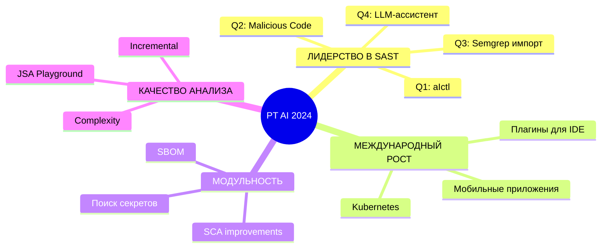

---
layout: center
transition: fade
---

  <h1 class="animate-glitch" style="animation-iteration-count: 1;">PT AI</h1>
  <h1 class="text-5xl mt-4 glitch">PRODUCT ROADMAP</h1>
  <h2 class="text-center mt-8 neon-pulse">2024</h2>
  
  

    ◈ SYSTEM READY ◈
  

---
layout: center
transition: fade
---

# КЛЮЧЕВЫЕ НАПРАВЛЕНИЯ

🚀

**ЛИДЕРСТВО В SAST** 
на рынке РФ

🌍

**МЕЖДУНАРОДНЫЙ РОСТ** 
кратный рост

💰

**РОСТ СРЕДНЕГО ЧЕКА** 
у текущих клиентов

📦

**ВЫХОД В СЕГМЕНТ** 
SCA/OSA

---
layout: center
transition: fade
class: relative
---

  Q1

<h1 class="text-8xl glitch" style="text-align: center;">Q1</h1>
<h2 class="text-center text-4xl mt-4" style="color: #ff00ff;">ПЕРВЫЙ КВАРТАЛ</h2>

---
layout: two-cols-header
transition: fade
---

# Q1 · ПРОДУКТОВЫЕ ФИЧИ

::left::

### 🚀 **aIctl CI/CD-ПЛАГИН**
`Единый инструмент интеграции`

**СТРАТЕГИЯ:** Лидерство в SAST + Международный рост

::right::

### 🛠️ **ПЛАГИН ДЛЯ VISUAL STUDIO**
`Анализ прямо в IDE`

**СТРАТЕГИЯ:** Международный рост

---

# Q1 · КЛЮЧЕВЫЕ МЕТРИКИ

⚡

### СКОРОСТЬ И КАЧЕСТВО
- Сокращение времени интеграции
- Предсказуемое поведение
- Снижение ручных шагов

🎨

### КАСТОМИЗАЦИЯ
- Сокращение времени обратной связи
- Снижение барьера входа

---
layout: center
transition: fade
class: relative
---

  Q2

<h1 class="text-8xl glitch" style="text-align: center;">Q2</h1>
<h2 class="text-center text-4xl mt-4" style="color: #ff00ff;">ВТОРОЙ КВАРТАЛ</h2>

---

# Q2 · ПРОДУКТОВЫЕ ФИЧИ

### 🔴 **MALICIOUS CODE**
`ML-модель для обнаружения вредоносных конструкций`

*Качество анализа и покрытие*

### 📊 **УПРАВЛЕНИЕ ОЧЕРЕДЯМИ**
`Централизованный сервис SLA`

*Скорость и устойчивость*

### 🔐 **ПОИСК СЕКРЕТОВ**
`MVP интеграция`

*Модульность / Платформенность*

### 📦 **ЗАГРУЗКА SBOM**
`Сторонний SBOM для SCA`

*Модульность / Платформенность*

---

# Q2 · РАСШИРЕНИЕ ПОКРЫТИЯ

📱

**1С**

☕

**JAVA 25**

#️⃣

**C# 13**

---
layout: center
transition: fade
class: relative
---

  Q3

<h1 class="text-8xl glitch" style="text-align: center;">Q3</h1>
<h2 class="text-center text-4xl mt-4" style="color: #ff00ff;">ТРЕТИЙ КВАРТАЛ</h2>

---

# Q3 · ПРОДУКТОВЫЕ ФИЧИ I

### 💳 **МОДУЛЬНОЕ ЛИЦЕНЗИРОВАНИЕ**
Гибкая система

### 🔄 **ИМПОРТ SEMGREP**
Поддержка правил через UI

### 📱 **МОБИЛЬНЫЕ ПРИЛОЖЕНИЯ**
Расширение анализа

### 🕸️ **ГРАФ ЗАВИСИМОСТЕЙ SCA**
Улучшение точности

---

# Q3 · ПРОДУКТОВЫЕ ФИЧИ II

### 📡 **ДОСТАВКА ЭКСПЕРТИЗЫ**
Автообновление фидов

### 🎨 **ОБНОВЛЕНИЕ UI SCA**
Новая карточка уязвимости

### ⚡ **МАТЧИНГ УЯЗВИМЫХ МЕТОДОВ**
Сопоставление с реальными вызовами в транзитивных зависимостях

---

# Q3 · СКОРОСТЬ И КАЧЕСТВО

### 🔧 **ПЕРЕРАБОТКА МЕХАНИЗМА**
Единый механизм детекта недостатков + DSL

### 📉 **ОПТИМИЗАЦИЯ COMPLEXITY**
Новые методы оценки сложности

---

# Q3 · РАСШИРЕНИЕ ПОКРЫТИЯ

🅰️

**ANGULAR V2**

🎯

**DART**

---
layout: center
transition: fade
class: relative
---

  Q4

<h1 class="text-8xl glitch" style="text-align: center;">Q4</h1>
<h2 class="text-center text-4xl mt-4" style="color: #ff00ff;">ЧЕТВЕРТЫЙ КВАРТАЛ</h2>

---

# Q4 · ПРОДУКТОВЫЕ ФИЧИ

### ☸️ **KUBERNETES**
Enterprise-деплой

### 🤖 **LLM-АССИСТЕНТ**
Ускорение triage

### 📁 **ПОРТФЕЛИ ПРОЕКТОВ**
Управление рисками

---

# Q4 · СКОРОСТЬ И КАЧЕСТВО I

### ⚡ **ИНКРЕМЕНТАЛЬНОЕ СКАНИРОВАНИЕ**
Сокращение времени анализа

### 🚀 **САМЫЙ БЫСТРЫЙ SAST**
AI‑powered + LLM‑бустинг

### 🗺️ **КАРТА ПОКРЫТИЯ КОДА**
Детализированный лог

### 🌳 **БОЛЬШИЕ ДЕРЕВЬЯ**
Борьба с экспоненциальным ростом

---

# Q4 · СКОРОСТЬ И КАЧЕСТВО II

### 🎮 **JSA PLAYGROUND**
- Точки входа/выхода
- Подмена значений
- Графы достижимости
- Интерактивная отладка

### 🏗️ **МОНОРЕПОЗИТОРИИ**
Prescan-слой + карта модулей

---

# Q4 · РАСШИРЕНИЕ ПОКРЫТИЯ

🐪

**PERL**

🐍

**PYTHON 3.14+**

⚡

**SCALA/AKKA**

---
layout: center
transition: fade
---

# СТРАТЕГИЧЕСКИЕ ПРИОРИТЕТЫ 2024

---
layout: end
transition: fade
---

  <h1 class="glitch text-7xl">СИСТЕМА ГОТОВА</h1>
  <h2 class="text-3xl mt-8 neon-pulse" style="color: #ff00ff;">PT AI — ЭВОЛЮЦИЯ АНАЛИЗА КОДА</h2>
  
  

    
      ❓ ВОПРОСЫ?
    
  

  
  

    ◈ ◈ ◈ SYSTEM READY ◈ ◈ ◈
  

