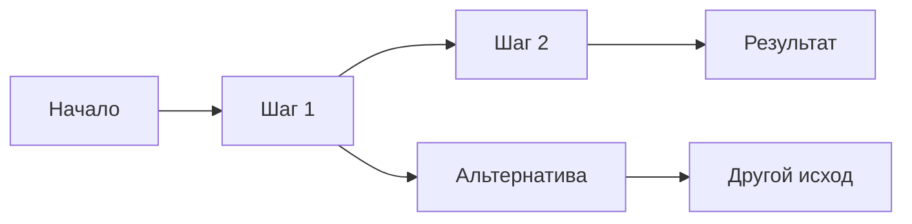

<!--
  CYBERPUNK TEMPLATE
  ==================
  Дизайн-система в terminal/cyberpunk стиле.

  ЦВЕТОВАЯ ПАЛИТРА:
    --primary  #00d4ff  cyan      — основной акцент, заголовки, ссылки
    --danger   #ff2d78  magenta   — предупреждения, акцентные элементы
    --success  #00ff9f  neon green — позитивные статусы, hero-line
    --accent   #bf5af2  purple    — вторичный акцент
    --warning  #ffe600  yellow    — предостережения, метки

  КОМПОНЕНТЫ (примеры на слайдах ниже):
    .kicker          — метка над заголовком [ LABEL ]
    .hero-title      — большой заголовок обложки с > и мигающим _
    .hero-sub        — подзаголовок обложки
    .cover-hero-line — градиентная полоска под титулом (длинные названия; см. slides.md + class: deck-cover)
    .hero-line       — акцентная строка с // внутри слайда
    .panel           — карточка-контейнер с neon-бордером и угловым маркером
    .status          — статус-бейдж внутри panel (.active / .warning / .accent)
    .badge           — pill-тег (.primary / .success / .danger / .accent / .warning)
    .badge-row       — контейнер для row из badges (добавь .left для выравнивания)
    .metric-grid     — сетка метрик 3 колонки (добавь .cols-5 / .cols-2 для вариантов)
    .metric          — карточка метрики с .metric-label и .metric-value
    .signal-list     — список сигналов (key → value)
    .signal          — строка с .signal-label и .signal-value
    .flow            — горизонтальный flow из .node и .arrow
    .note            — сноска под панелью (серый текст, верхний бордер)
    .stack           — вертикальный grid-контейнер
    .grid-2-even     — горизонтальная сетка 2 колонки 1fr 1fr
    .center-xy       — flex center по обоим осям (для cover layout)
    .big-num         — большое число (.c-primary / .c-accent / .c-danger / .c-warning / .c-success)
    .goal-label      — мелкая подпись под big-num
    .map-table       — таблица маппинга (ячейки .check / .partial / .none)

  РАСШИРЕНИЯ (styles/cyberpunk.css, деки вроде slides.md):
    .callout / .callout--key  — выноски
    .cyber-columns / .cyber-col / .cyber-col--sast / .cyber-col--dast — две колонки
    .cyber-statement          — крупный финальный акцент
    .cyber-checklist          — список с маркерами ▸

  СТИЛЬ «slides - цели Q2.md» (те же правила в cyberpunk.css, без <style> в .md):
    ul.ul-arrows              — маркеры → как в Q2
    table.map-table--q2       — компактная матрица (✔ / ⚠ / —), 2-я колонка текст слева
    .big-num--q2 / .goal-label--q2 — фикс. размер числа как в Q2

  LAYOUTS (Slidev встроенные):
    layout: center      — вертикальное центрирование
    layout: two-cols    — две колонки, правая через ::right::

  ЗАПУСК:
    npx slidev my-presentation.md --open
-->

<!--
  СТИЛИ (Slidev 52+): не вставляйте большой <style> в .md — scoped и не попадает на .slidev-layout.
  • Дек в корне (slides.md): styles/index.css → cyberpunk.css
  • Этот файл в templates/: templates/styles/index.css → ../../styles/cyberpunk.css (см. папку templates/styles/)
  В YAML: defaults.layout: default и layout: center на обложке (см. выше).
-->

<!--
  СЛАЙД 1: ОБЛОЖКА (cover)
-->

<div class="center-xy">
  <div class="kicker">контекст × тема</div>
  <div class="hero-title">НАЗВАНИЕ ПРЕЗЕНТАЦИИ</div>
  <div class="hero-sub">
    подзаголовок или краткая суть
  </div>

  <div class="badge-row">
    <span class="badge primary">Тема 1</span>
    <span class="badge danger">Тема 2</span>
    <span class="badge warning">Тема 3</span>
    <span class="badge accent">Тема 4</span>
    <span class="badge success">Тема 5</span>
  </div>
</div>

---

<!--
  СЛАЙД 2: КОНТЕНТ С ПАНЕЛЬЮ
  .panel — основной контейнер
  .status — метка типа (.active / .warning / .accent)
  .hero-line — акцентная строка с //
  .note — подвал панели
-->

# ЗАГОЛОВОК СЛАЙДА

<div class="panel">
  <div class="status active">статус / метка</div>
  <div class="hero-line">ключевой тезис слайда</div>
  <p>Основной текст. Объяснение сути. Можно несколько предложений — они занимают нужное место без лишних стилей.</p>
  <div class="note">
    Сноска или дополнение — серый текст внизу панели.
    <div class="badge-row left">
      <span class="badge primary">Тег A</span>
      <span class="badge success">Тег B</span>
      <span class="badge danger">Тег C</span>
    </div>
  </div>
</div>

---

<!--
  СЛАЙД 3: МЕТРИКИ
  .metric-grid — сетка (по умолчанию 3 колонки)
  Добавь .cols-2 или .cols-5 для другого числа колонок
-->

# МЕТРИКИ

<div class="metric-grid">
  <div class="metric">
    <div class="metric-label">Метрика 1</div>
    <div class="metric-value">42%</div>
  </div>
  <div class="metric">
    <div class="metric-label">Метрика 2</div>
    <div class="metric-value">8x</div>
  </div>
  <div class="metric">
    <div class="metric-label">Метрика 3</div>
    <div class="metric-value">high</div>
  </div>
</div>

<div class="panel">
  <div class="hero-line">комментарий к метрикам</div>
  <p>Дополнительный контекст — что означают эти числа и почему они важны.</p>
</div>

---

<!--
  СЛАЙД 4: СИГНАЛЫ (ключ → значение)
  .signal-list / .signal / .signal-label / .signal-value
-->

# СИГНАЛЫ

<div class="panel">
  <div class="status warning">проблема</div>
  <div class="hero-line">что именно не так</div>

  <div class="signal-list">
    <div class="signal">
      <div class="signal-label">signal 01</div>
      <div class="signal-value">первый сигнал — описание проблемы или наблюдения</div>
    </div>
    <div class="signal">
      <div class="signal-label">signal 02</div>
      <div class="signal-value">второй сигнал — продолжение анализа ситуации</div>
    </div>
    <div class="signal">
      <div class="signal-label">signal 03</div>
      <div class="signal-value">третий сигнал — итоговое наблюдение</div>
    </div>
  </div>

  <div class="note">Вывод из сигналов или призыв к действию.</div>
</div>

---

<!--
  СЛАЙД 5: FLOW (цепочка шагов)
  .flow / .node / .arrow
-->

# FLOW / PIPELINE

<div class="panel">
  <div class="status accent">процесс</div>
  <div class="hero-line">как это работает сейчас</div>

  <div class="flow">
    <span class="node">шаг 1</span>
    <span class="arrow">→</span>
    <span class="node">шаг 2</span>
    <span class="arrow">→</span>
    <span class="node">шаг 3</span>
    <span class="arrow">→</span>
    <span class="node">результат</span>
  </div>

  <div class="note">Пояснение к цепочке или описание проблемного звена.</div>
</div>

---
layout: two-cols
---

<!--
  СЛАЙД 6: ДВЕ КОЛОНКИ
  layout: two-cols — встроенный layout Slidev
  Разделитель ::right:: переключает на правую колонку
-->

## Левая колонка

- пункт первый
- пункт второй
- пункт третий
- пункт четвёртый

::right::

## Правая колонка

- пункт первый
- пункт второй
- пункт третий
- пункт четвёртый

---

<!--
  СЛАЙД 7: ДИАГРАММА MERMAID
  Блок ```mermaid — рендерится автоматически
  Обязательно закрывать ровно тремя обратными кавычками
-->

# ДИАГРАММА



---

<!--
  СЛАЙД 8: STACK + GRID-2-EVEN
  .stack — вертикальный стек; .grid-2-even — две равные колонки
-->

# STACK И ДВЕ КОЛОНКИ

<div class="panel">
  <div class="status accent">компоновка</div>
  <div class="hero-line">вертикальный стек и сетка 1fr 1fr</div>

  <div class="stack">
    <div class="grid-2-even">
      <div>
        <p class="goal-label">колонка A</p>
        <p>Текст или список слева — компактно, без лишних обёрток.</p>
      </div>
      <div>
        <p class="goal-label">колонка B</p>
        <p>Текст или список справа — зеркально по сетке.</p>
      </div>
    </div>
    <p class="note">Сочетай .stack и .grid-2-even внутри .panel для плотных слайдов.</p>
  </div>
</div>

---

<!--
  СЛАЙД 9: BIG-NUM + GOAL-LABEL
-->

# КРУПНЫЕ ЧИСЛА

<div class="panel">
  <div class="status active">аналитика</div>
  <div class="hero-line">метрики в фокусе</div>

  <div class="grid-2-even" style="margin-top: 0.5rem;">
    <div>
      <div class="goal-label goal-label--q2">как в Q2 (фикс. размер)</div>
      <div class="big-num big-num--q2 c-primary">94%</div>
    </div>
    <div>
      <div class="big-num c-success">12ms</div>
      <div class="goal-label">шаблон: подпись снизу</div>
    </div>
    <div>
      <div class="big-num c-danger">3</div>
      <div class="goal-label">критичных</div>
    </div>
    <div>
      <div class="big-num c-warning">Δ</div>
      <div class="goal-label">дрейф</div>
    </div>
  </div>
</div>

---

<!--
  СЛАЙД 9b: СПИСКИ КАК В «slides - цели Q2.md»
  Маркер → через ul.ul-arrows (не обычный markdown-список)
-->

# СПИСКИ (Q2)

<div class="panel">
  <div class="status active">ul.ul-arrows</div>
  <div class="hero-line">те же стрелки, что во встроенном стиле Q2-дека</div>

  <ul class="ul-arrows">
    <li>первый пункт — стрелка слева, JetBrains Mono</li>
    <li>второй пункт</li>
    <li>третий пункт</li>
  </ul>

  <div class="note">Обычные markdown-списки в cyberpunk.css — с диском; для Q2 оборачивай в <code>&lt;ul class="ul-arrows"&gt;</code>.</div>
</div>

---

<!--
  СЛАЙД 10: MAP-TABLE
  • .map-table — карточные ячейки с заливкой
  • .map-table.map-table--q2 — компактная матрица как в Q2 (первая колонка #, вторая — текст)
-->

# ТАБЛИЦЫ МАППИНГА

<div class="panel">
  <div class="status warning">два варианта</div>
  <div class="hero-line">классическая .map-table</div>

  <table class="map-table">
    <thead>
      <tr>
        <th>Область</th>
        <th>SAST</th>
        <th>DAST</th>
        <th>Ручной</th>
      </tr>
    </thead>
    <tbody>
      <tr>
        <td>Код</td>
        <td class="check">✓</td>
        <td class="partial">~</td>
        <td class="partial">~</td>
      </tr>
      <tr>
        <td>Runtime</td>
        <td class="none">✕</td>
        <td class="check">✓</td>
        <td class="check">✓</td>
      </tr>
    </tbody>
  </table>
</div>

<div class="panel" style="margin-top: 0.75rem;">
  <div class="hero-line" style="font-size: 1em;">и Q2-стиль: .map-table--q2</div>

  <table class="map-table map-table--q2">
    <thead>
      <tr>
        <th style="width: 6%;">#</th>
        <th style="width: 40%; text-align: left;">Инициатива</th>
        <th style="width: 18%;">Цель A</th>
        <th style="width: 18%;">Цель B</th>
        <th style="width: 18%;">Цель C</th>
      </tr>
    </thead>
    <tbody>
      <tr>
        <td>1</td>
        <td>Пример строки</td>
        <td class="check">✔</td>
        <td class="partial">⚠</td>
        <td class="none">—</td>
      </tr>
      <tr>
        <td>2</td>
        <td>Вторая строка</td>
        <td class="none">—</td>
        <td class="check">✔</td>
        <td class="check">✔</td>
      </tr>
    </tbody>
  </table>

  <div class="note"><code>.check</code> / <code>.partial</code> / <code>.none</code> — только цвет, без заливки ячеек.</div>
</div>

---

<!--
  СЛАЙД 11: РАСШИРЕНИЯ (callout, cyber-columns)
-->

# ВЫНОСКИ И ДВЕ КОЛОНКИ

<div class="cyber-columns">
  <div class="cyber-col cyber-col--sast">
    <p><strong>Вариант A</strong> — краткий тезис слева.</p>
  </div>
  <div class="cyber-col cyber-col--dast">
    <p><strong>Вариант B</strong> — краткий тезис справа.</p>
  </div>
</div>

<div class="callout callout--key">

**Инсайт:** вынеси главную мысль в `.callout` или `.callout--key`.

</div>

---
layout: center
---

<!--
  СЛАЙД 12: ФИНАЛЬНЫЙ (итоговый тезис)
  Используй center layout + .center-xy для центрирования
-->

<div class="center-xy">
  <div class="kicker">итог</div>
  <div class="hero-title" style="font-size: 2.4em;">
    ФИНАЛЬНЫЙ ТЕЗИС
  </div>
  <div class="hero-sub">
    краткое резюме или призыв к действию
  </div>

  <div class="badge-row">
    <span class="badge primary">Ключевое 1</span>
    <span class="badge success">Ключевое 2</span>
    <span class="badge accent">Ключевое 3</span>
  </div>
</div>
